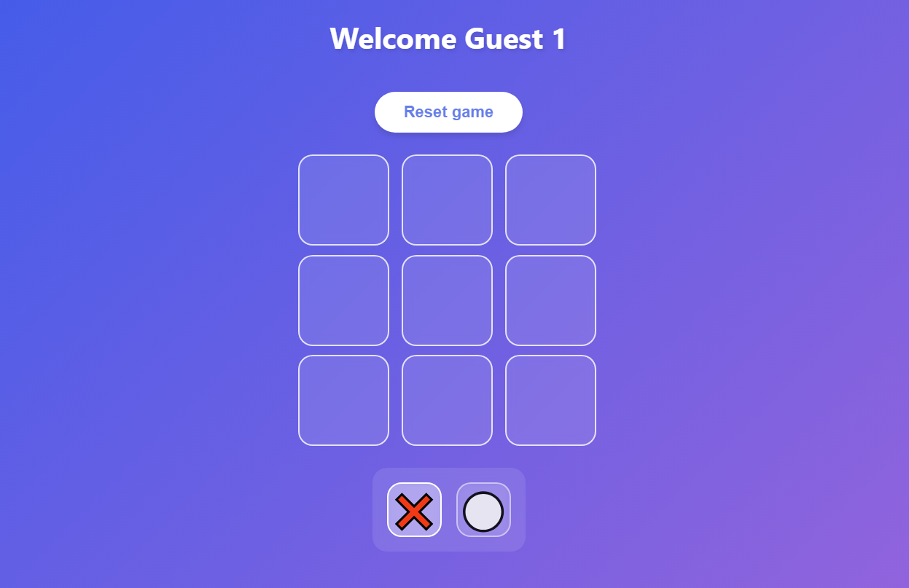

# <h1 align=center> **`Tic Tac Toe Game`** </h1>

<p align="center">
    
    
</p>

Read this in [Spanish](README-es.md) / Lee este archivo en [español](README-es.md)  
Check out the [Live Demo](https://your-vercel-deployment-url.vercel.app)insights found and final recomendations in [here](deliverables/findings-report.md)

# 

A simple Tic Tac Toe game built with React, featuring a computer player and various animations, including confetti for the winner. This project uses Vite for development and bundling, and includes a sound manager for game actions.


## Features

- **Single Player Mode**: Play against the computer.
- **Pulished UI**: Simple interface with a winning popup showing the game result.
- **Sound effects** for moves, win, draw, and computer's turn.

## Future Features (ToDo)

- **Two modes**: Player vs. Computer, Player vs. Player.
- **Online Multiplayer Mode**: Enable real-time Player vs. Player gameplay using **Socket.IO** and **Nodemon** for seamless communication between two players.
- **Responsive UI**: The game board adjusts to different screen sizes.
- **Persistence on Page Reload**: The game state will be persisted across page reloads, ensuring users can resume their game even after refreshing the page.
- **Automatic Reconnection**: In case of network failures or disconnections during an online game, ensuring a smooth user experience.

## Installation

### Prerequisites

Before you start, make sure you have the following installed:

- [Node.js](https://nodejs.org/) (version 16 or higher)
- [npm](https://www.npmjs.com/) (usually installed with Node.js)

### Steps

1. Clone the repository to your local machine:

   ```bash
   git clone https://github.com/your-username/tic-tac-toe.git
   cd tic-tac-toe
   ```

2. Install dependencies:

   ```bash
   npm install
   ```

3. Start the development server:

   ```bash
   npm run dev
   ```

4. Open your browser and navigate to [http://localhost:5173](http://localhost:5173) to play the game.

## Scripts

- `npm run dev`: Starts the development server.
- `npm run build`: Builds the project for production.
- `npm run preview`: Previews the production build locally.
- `npm run lint`: Lints the codebase using ESLint.

## Dependencies

The project uses the following libraries:

- **React**: Frontend framework for building the UI.
- **React Router DOM**: For routing between pages (e.g., game, home).
- **Canvas Confetti**: For confetti effects when a player wins.
- **Lucide React**: For vector icons.
- **Socket.io-client**: For possible future multiplayer features (not yet implemented).
- **Vite**: For fast bundling and development.

## Game Features


## Screenshots


## License

This project is licensed under the MIT License - see the [LICENSE](LICENSE) file for details.

## Contributing

1. Fork the repository.
2. Create your feature branch (`git checkout -b feature-name`).
3. Commit your changes (`git commit -m 'Add new feature'`).
4. Push to the branch (`git push origin feature-name`).
5. Open a pull request.

---

This `README.md` should provide all the necessary information for someone to get started with your project, as well as details about the dependencies and available scripts.